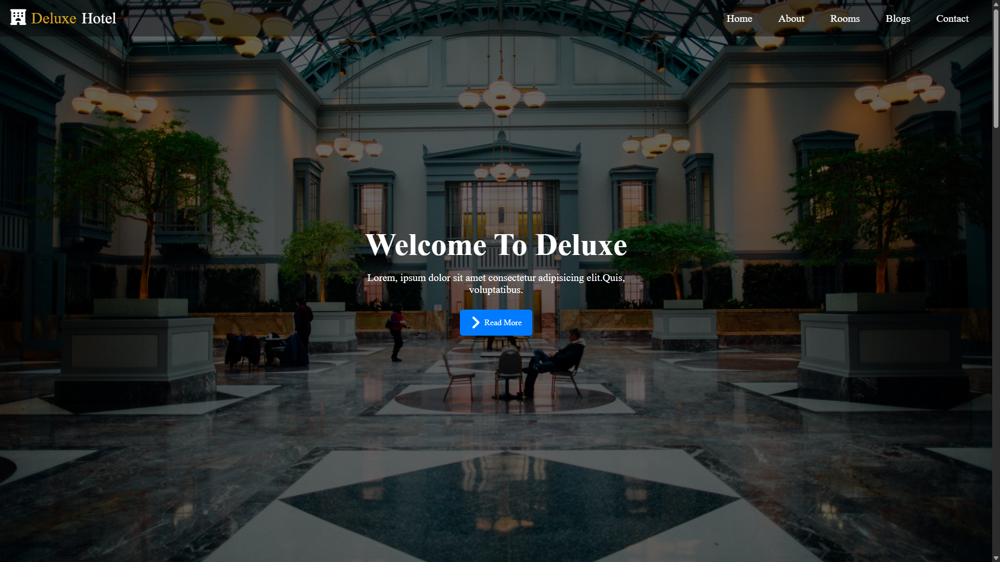
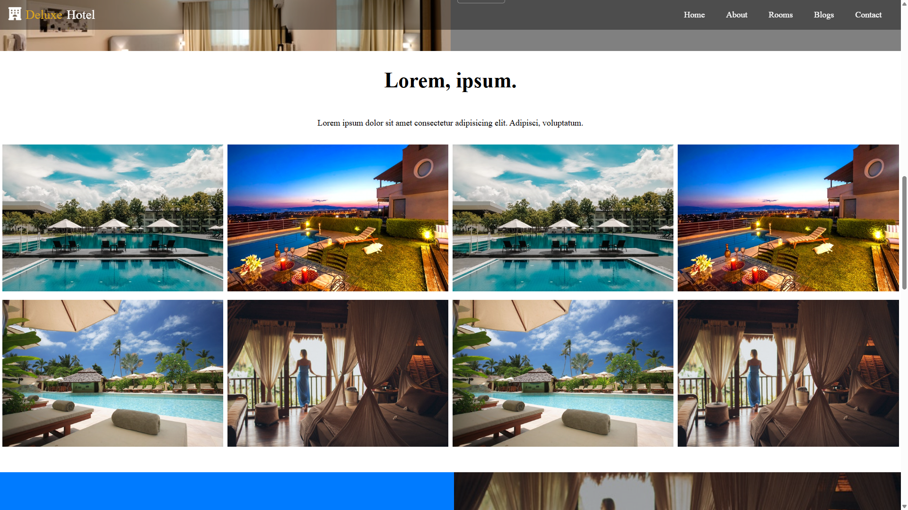
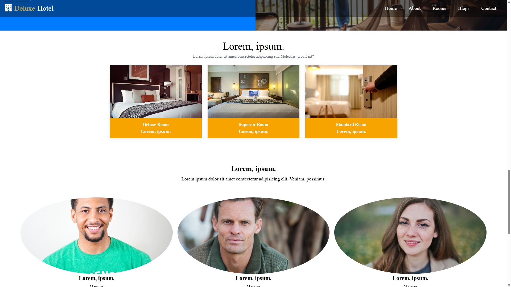
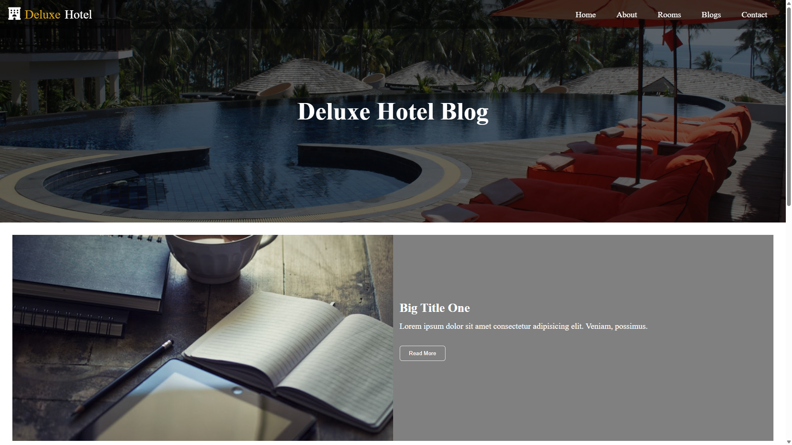

# 🏨 Deluxe Hotel Website

A fully responsive **Hotel Landing Page** built using **HTML5 & CSS3**.  
The project includes modern sections such as hero, gallery, rooms, blog and contact form.  
Designed as part of a front-end learning journey.

---

## 📸 Screenshots

### 🏠 Home (Hero Section)

### 🖼️ Gallery Section

### 🛏️ Rooms Section

### 📝 Blog Page

### 📩 Contact Section

---

## ✨ Features

- Fully responsive layout  
- Clean and modern UI  
- Hero introduction section  
- About / Services area  
- Rooms section with cards  
- Image gallery (grid)  
- Customer service section  
- Manager / Team cards  
- Blog page layout  
- Contact form  
- Reusable CSS structure  

---

## 🛠️ Technologies Used

- **HTML5**
- **CSS3**
- **Flexbox**
- **Responsive Design**
- **Font Awesome Icons**

